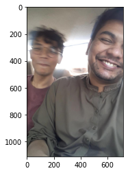
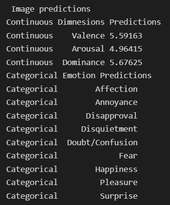
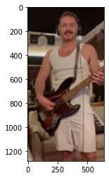
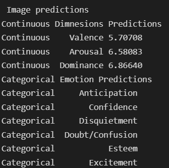

# Emotion based Music Generation
Music is a powerful medium for evoking emotions, and the ability to generate music that is tailored to a specific emotion would have numerous applications. In the field of film scoring, for example, being able to automatically generate music that matches the emotional content of a scene could greatly speed up the scoring process and allow for more personalized soundtracks. Similarly, in the field of video game design, being able to generate music that dynamically responds to in-game events and player actions could enhance the immersive experience for players.


## Features

Our work build upon and expands the work of two different repositorries [https://github.com/Tandon-A/emotic][EmLink] and  while also experimenting with different parts of the project. Our project utilizes the work done by the authors of the "Context Based Emotion Recognition using EMOTIC Dataset" and "EMOPIA: A Multi-Modal Pop Piano Dataset For Emotion Recognition and Emotion-based Music Generation". 

To generate music from captured emotions we divide our work in 2 different modules:

- Detection of emotions and predictions of VAD Scores 
- Generation of Music

This work focuses on generating piano music from the captured emotions from the pictures provided during inference time. 

For the generation of VAD scores we made some changes to the architecture proposed by the authors of "Context Based Emotion Recognition using EMOTIC Dataset". This work utilizes 2 different Resnet-18 backbones to extract contextual and body information from the image provided. Resnet-18 extracting the contextual information is trained on Places 365 dataset (link provided in the github repository https://github.com/Tandon-A/emotic). 

During experimentation we replaced the conextual backbone with: 

> - Resnet-50 
> - Omnivore_swinB (facebook research_SceneRecog_SOA)


| Models    | Batch Size |Epochs|mAP |
| :-----------: | :-----------: | :-----------: |:-----------: |
| **Resnet_18 backbone in context model**   | 52       |15 |0.27550 |
| **Resnet_50 backbone in context model**    | 104       |10 |0.2599 |
| **omnivore_swinB (facebook research_SceneRecog_SOA)**   | 12      |10|0.40|

**NOTE:** All of the above were pretrained on places365 dataset
## Results 
| Input   | VAD Scores |Music Generated|
| :-----------: | :-----------: | :-----------: |
|   | |[Generated Audio](https://github.com/asadimtiazmalik/EmotionbasedMusicGeneration/blob/main/audio.mpeg)|
|    |        |N/A |


## References
```
@article{kosti2020context,
  title={Context based emotion recognition using emotic dataset},
  author={Kosti, Ronak and Alvarez, Jose M and Recasens, Adria and Lapedriza, Agata},
  journal={arXiv preprint arXiv:2003.13401},
  year={2020}
}
```

```
@inproceedings{{EMOPIA},
         author = {Hung, Hsiao-Tzu and Ching, Joann and Doh, Seungheon and Kim, Nabin and Nam, Juhan and Yang, Yi-Hsuan},
         title = {{MOPIA}: A Multi-Modal Pop Piano Dataset For Emotion Recognition and Emotion-based Music Generation},
         booktitle = {Proc. Int. Society for Music Information Retrieval Conf.},
         year = {2021}
}
```


